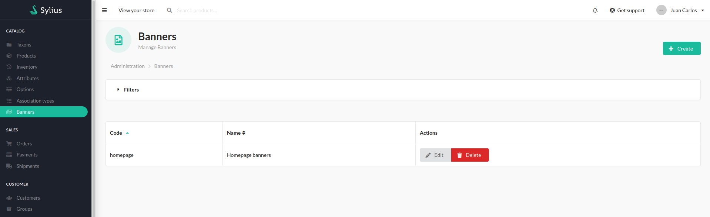
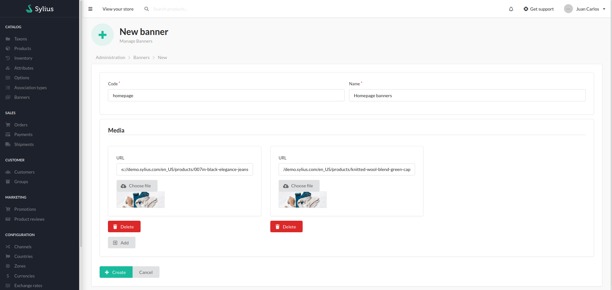
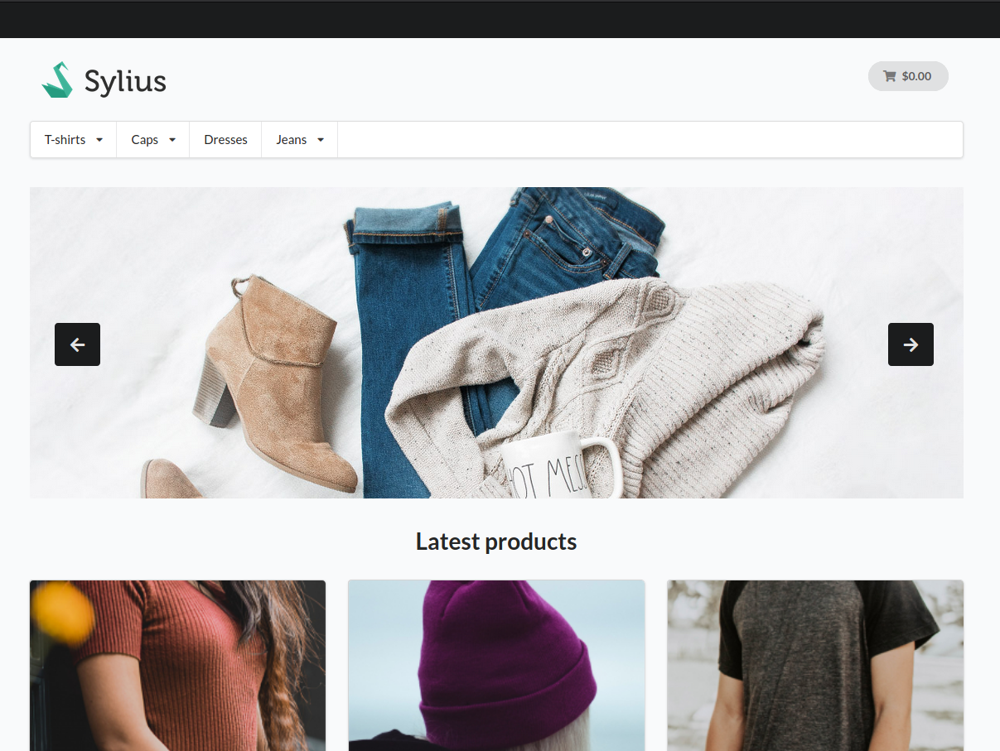

# Sylius Banner Plugin
Add banner functionality to your store.

## Screenshots







## Installation

### Download the plugin via composer

```bash
$ composer require jchr86/sylius-banner-plugin
```

### Enable the plugin
Register the plugin by adding it to your `config/bundles.php` file

```php
<?php

return [
    // ...
    Jchr86\SyliusBannerPlugin\Jchr86SyliusBannerPlugin::class => ['all' => true],
];
```

### Configure the plugin

```yaml
# config/packages/jchr86_sylius_banner.yaml

imports:
    - { resource: "@Jchr86SyliusBannerPlugin/Resources/config/config.yaml" }
```

### Import admin routing

```yaml
# config/routes/sylius_admin.yaml

# ...
jchr86_sylius_baner_admin:
    resource: "@Jchr86SyliusBannerPlugin/Resources/config/admin_routing.yaml"
    prefix: /admin
```

### Import shop routing

```yaml
# config/routes/sylius_shop.yaml

# ...
jchr86_sylius_banner_shop:
    resource: "@Jchr86SyliusBannerPlugin/Resources/config/shop_routing.yaml"
```

### Update your database

```bash
$ bin/console doctrine:migrations:diff
$ bin/console doctrine:migrations:migrate
```

### Install assets & clear cache

```bash
$ bin/console assets:install
$ bin/console cache:clear
```

## Usage

##### 1. Create a banner from the admin.

##### 2. Create a template: `templates/homepage/_my_banner.html.twig`
+ `code`: Banner code
+ `template`: Template used for render.

```twig
{{ render(url('jchr86_sylius_banner_by_code', {'code': 'homepage', 'template': '@Jchr86SyliusBannerPlugin/banner/_carousel.html.twig'})) }}
```

##### 3. Add the banner to the homepage.

```yaml
# config/packages/_sylius.yaml

# ...
sylius_ui:
    events:
        sylius.shop.homepage:
            blocks:
                jchr86_banner:
                    template: "homepage/_my_banner.html.twig"
                    priority: 100
```

## TODO

+ Tests.
+ Validation.
